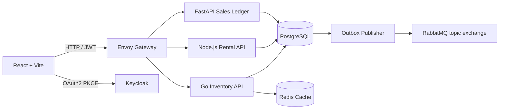

# Jupiter Cars

An automotive sales and rental platform organized as a small, runnable service monorepo.

## Architecture

PostgreSQL is the source of truth. Rental intervals are half-open (`[start,end)`), so adjacent bookings are valid; a GiST exclusion constraint prevents overlap even if application-level locking is bypassed. Rental and sales events are committed to an outbox in the same transaction as their business data and published asynchronously to RabbitMQ.

The durable topic exchange is `jupiter.events`, with routing keys and queues for `vehicle.booked`, `sale.completed`, and `inventory.updated`. The outbox publisher retries failures with backoff and delivery is at least once; downstream consumers should deduplicate by event ID.

## Run locally

Requirements: Docker Compose v2. Copy `.env.example` to `.env`, replace the development secrets, then run `docker compose up --build`. The web app is served at `http://localhost:8081`; Envoy exposes APIs at `http://localhost:8080`; Keycloak is at `http://localhost:8082`.

Keycloak imports the development realm in `infra/keycloak/jupiter-realm.json`; registration is enabled and browser authentication uses OAuth2 authorization-code flow with PKCE. Assign the `admin` realm role in the Keycloak console to enable the operations dashboard. Replace all `CHANGE_ME` values, configure a stable public issuer and TLS at the edge, and use managed secrets, storage, backups, and key rotation before production deployment. Compose uses Keycloak development mode and is a local integration environment, not a production deployment topology.

## API

- `GET /api/v1/vehicles/search?q=&type=&minPrice=&maxPrice=`
- `GET /api/v1/vehicles/{vin}`
- `GET /api/v1/rentals/availability?vehicleId=&startDate=&endDate=`
- `POST /api/v1/rentals/reserve` (JWT required)
- `POST /api/v1/sales/checkout` (JWT required)
- `GET /health` (liveness)

Reserve body: `{"vehicleId":"<uuid>","startDate":"2026-10-08","endDate":"2026-10-11"}`. The end date is exclusive and the server calculates the amount from the stored daily rate. Checkout requires an `Idempotency-Key` header.

Sales checkout persists an accepted contract, sale, vehicle status change, invoice, and outbox event atomically. It does not capture payment; connect a payment provider and complete its authorization/capture workflow before accepting real purchases.

## Verification

Run `docker compose --env-file .env.example config --quiet` to validate configuration. Service-local checks are `cd services/rentals && npm test`, `cd services/inventory && go test ./...`, `cd services/sales && python -m unittest test_main`, and `cd web && npm test && npm run build`. CI additionally applies the migration and exercises the PostgreSQL exclusion constraint.

`deploy_to_github.sh` publishes this authored source tree. By default it uses the current directory; set `OUTPUT_DIR` to an empty sibling path to materialize a clean copy of the project before initializing Git. Review the files, then explicitly opt into a public repository with `CONFIRM_PUBLIC_PUBLISH=YES_I_MEAN_PUBLIC ./deploy_to_github.sh`. It never force-pushes and refuses to change the visibility of an existing private repository.

The Pages workflow publishes `web/dist` at the repository subpath. Before enabling it, configure the repository Actions variables `JUPITER_PUBLIC_API_URL` and `JUPITER_PUBLIC_KEYCLOAK_URL` with publicly reachable HTTPS service origins; the workflow intentionally fails until both are present. GitHub Pages hosts only the frontend and does not deploy the Compose backend.
